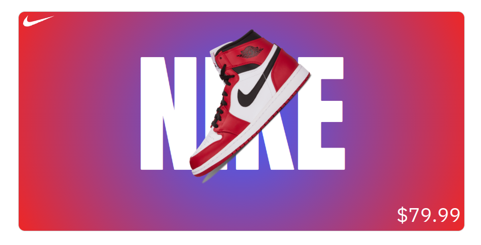

# Nike Advertising

Basic HTML project

## Concepts

1. Basic HTML5 structure
2. Grid 
3. Fonts https://fonts.google.com/?preview.size=43&preview.layout=grid
4. Gradient https://cssgradient.io/
5. SVG
6. Media Queries
7. hover (rotate sneaker image)

## Refs

https://www.w3docs.com/snippets/html/html5-page-structure.html

https://www.w3docs.com/learn-html/html-basic.html